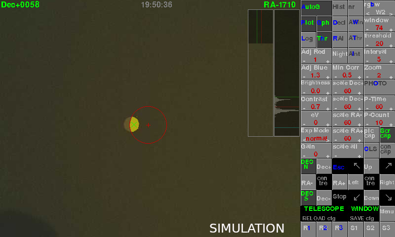

# Pi-LC-Autoguider

# In development, therefore BETA, to work with RaspiOS based on BULLSEYE, using libcamera (NOT raspistill/raspivid).
# At your own risk !!. Ensure you have any required software backed up.

This script was developed using a Raspberry PI with libcamera to auto guide a telescope through a ST-4 port using a Raspberry Pi (Pi2B/Pi3B/Pi3B+/Pi4 recommended) and a suitable interface. For interface details etc see https://github.com/Gordon999/Pi-AutoGuider

## Screenshot

To install:

Install latest RaspiOS based on Bullseye (tested with FULL 32bit version)

then...

sudo apt install libsdl2-ttf-2.0-0

python3 -m pip install -U pygame --user

sudo apt install libsdl-gfx1.2-5 libsdl-image1.2 libsdl-kitchensink1 libsdl-mixer1.2 libsdl-sound1.2 libsdl-ttf2.0-0 libsdl1.2debian libsdl2-2.0-0 libsdl2-gfx-1.0-0 libsdl2-image-2.0-0 libsdl2-mixer-2.0-0 libsdl2-ttf-2.0-0

Download PiLCAG.py, copy to /home/pi and run it

The interface can be an opto-isolator, relay card available for the Pi, eg Seeed Raspberry PI card, PiFace Relay Plus card, Sainsmart USB 4 relay card or any 4 relay card you interface.

The relay cards can also be modified, different wiring to scope, to auto-guide other scopes eg Meade LX-10.

It can also be interfaced to scopes via an Arduino Uno or Pi Pico, via USB. The Arduino Uno or Pi Pico can also be controlled by a PC using software such as PHD. Details can be found under the Arduino-Uno-AutoGuider repository.

The Pi can also control a Canon DSLR, via an interface, to allow long exposure photographs.

Sony A6000* can also be used for long exposure photographs and controlled by 3 methods...

*Note although A6000 is tested I have also tested on a A7R4 so should work on several Sony models. Note you can't use the Electronic shutter with BULB.

If you want to try your camera download my https://github.com/Gordon999/Pi-Sony-A6000-remote and try them. Connect an IR led to gpio pin number 36.

Modifying Sony RM-SPR1 remote button (See Sony.txt and related photos) with extra FOCUS control gpio added (pin 23).
Use of Infra Red diode to a gpio and Sony RMT-VP1 receiver..
Use of Infra Red diode to a gpio directly to camera (limited camera battery life !!)
Please take care when interfacing your telescope or camera. At your own risk.
